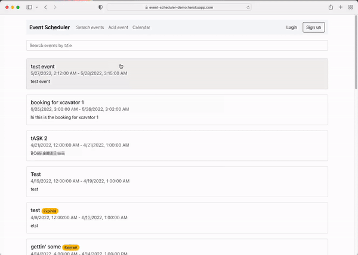

# Event Scheduler App

This project was bootstrapped with [Create React App](https://github.com/facebook/create-react-app).

Event Scheduler is a React app that allows users to create events. An event can be anything, such as a sport event, team meeting, personal note, etc. An event consists of title, start and end date/time, and description. All events are public by default (visible to everyone). They can also be private (only visible to you) by checking the private checkmark.

> You can only edit or remove an event if you're the owner of that event.

### [Demo](https://event-scheduler-demo.herokuapp.com/) :movie_camera:

## Tech Stack

### Frontend

- React
- Typescript
- Bootstrap
- Apollo client
- JS cookie

### Backend

- NodeJS with Express
- Typescript
- Apollo server express
- JSON web token
- MongoDB with mongoose

> APIs implemented using GraphQL

## Run app locally

> Make sure MongoDB is up and running

In the project directory, you can run:

### `npm start`

Runs the backend and frontend apps simultaneously in the development mode.\

> Or if you prefer running the apps separately by running `start:web` and `start:server` in separate terminals.

Open [http://localhost:3000](http://localhost:3000) to view it in the browser.

The page will reload if you make edits.\
You will also see any lint errors in the console.

## Current functionality

- User signup and login
- Create, update and delete events
- Search & pagination
- Make events as private (only visible to creators)
- Session expiry warning (displayed when being idle for 3 minutes after logging in)

### Coming soon

- User profile
- Admin tab & profile
- Share events with family & friends on Facebook

## Run unit tests

coming soon...

## Run E2E tests

coming soon...

### Author :books:

[Ahmed Alatawi](https://github.com/AhmedAlatawi)
